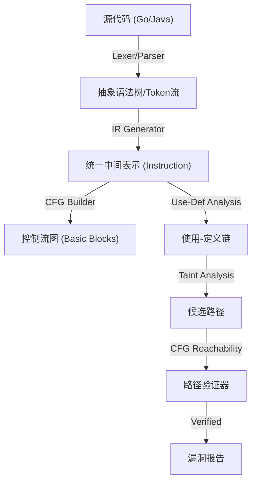

# SAST Demo 

这是一个基于 Go 和 Vue 3 开发的现代静态应用程序安全测试 (SAST) 演示demo。它不仅能够检测代码中的安全漏洞，还提供了可视化的控制流图 (CFG)、中间代码 (IR) 展示以及交互式的污点传播路径追踪功能。

## 核心功能

- **多语言支持**: 支持 **Go** (原生 AST 解析) 和 **Java** (自定义 IR 生成) 的静态分析。
- **深度可视化**:
  - **AST (抽象语法树)**: 交互式展示代码的语法结构，支持节点与源代码的联动高亮。
  - **CFG (控制流图)**: 使用 Mermaid.js 渲染函数的控制流结构，支持缩放和平移。
  - **IR (中间表示)**: 展示类似于汇编的线性中间代码，便于理解底层分析逻辑。
  - **交互式污点追踪**: 在源代码中高亮显示从 Source (输入源) 到 Sink (漏洞点) 的完整数据流路径。
- **Web 管理界面**: 现代化的 Vue 3 前端，提供文件浏览、实时扫描和结果展示。
- **全面漏洞检测**:
  - **SQL 注入**: 支持 JDBC, JPA, Hibernate等。
  - **命令注入 (RCE)**: 检测 `exec`, `Runtime.exec` 等危险调用。
  - **跨站脚本 (XSS)**: 追踪未过滤的 HTTP 响应输出。
  - **SSRF**: 检测服务端发起的恶意请求。
  - **路径遍历**: 识别不安全的文件操作路径。

## 效果展示

我们为java和go分别提供了漏洞测试文件：

* `examples/java/vulns.java`
* `examples/go/vulns.go`

填入文件路径即可进行漏洞分析

AST语法树的查看：


污点追踪效果与IR展示：


支持生成CFG，可以查看每个basic block的IR：


整体CFG如下：


存在对应漏洞的basic blocks会红色高亮：


## 技术原理与实现

本系统采用先进的 **IR (Intermediate Representation)** 架构，将不同语言的源代码转换为统一的中间表示，从而实现跨语言的通用分析逻辑。

### 1. 总体架构



### 2. 核心组件详解

#### A. 统一中间表示 (IR)
系统定义了一套简化的三地址码指令集 (`pkg/core/ir.go`)，作为分析的基础：
- **BasicBlock (基本块)**: 包含一系列顺序执行的指令，最后是一个跳转指令。
- **Instruction (指令)**: 格式为 `Result = Op Operand1, Operand2`。
- **OpCode**: 支持 `OpAssign` (赋值), `OpCall` (调用), `OpBranch` (条件跳转), `OpJump` (无条件跳转) 等。

#### B. 语言前端 (Language Frontends)
- **Go 分析器**: 使用 Go 标准库 `go/ast` 解析源代码，遍历 AST 并生成 IR 指令。解决了复杂的选择器表达式 (如 `r.URL.Query`) 解析问题。
- **Java 分析器**: 
  - 实现了一个**基于栈的自定义解析器** (`pkg/lang/java/ir_gen.go`)。
  - 通过正则流式扫描源码，使用控制流栈 (Control Stack) 处理嵌套的 `if/else`, `while`, `for` 结构。
  - 自动生成对应的 `OpBranch` 和 `OpJump` 指令，从而构建出完整的 CFG，解决了传统正则匹配无法理解控制流的缺陷。

#### C. 污点分析引擎 (Taint Engine)
- **混合分析模式 (Hybrid Analysis)**: 结合了 **Use-Def Chain (数据流)** 的高效性与 **CFG (控制流)** 的精确性。
- **分析流程**:
  1. **Source 识别**: 根据配置规则 (Regex) 标记引入污点的指令 (如 `request.getParameter`)。
  2. **数据流追踪 (Data Flow)**: 基于 Use-Def 链快速寻找从 Source 到 Sink 的潜在数据依赖路径 (Candidate Path)。
  3. **控制流验证 (Control Flow Validation)**: 
     - 对候选路径进行**CFG 可达性检查 (Reachability Check)**。
     - 验证路径上的每一步是否在控制流图上真实可达，剔除死代码或逻辑上不可执行的分支（如 `if(false)`）中的误报。
  4. **漏洞判定**: 只有同时满足数据依赖和控制流可达性的路径才会被报告为漏洞。

### 3. UI
- **Frontend**: Vue 3 + Vite + Ant Design Vue。
- **Graphing**: 使用 `mermaid` 渲染 CFG，结合 `panzoom` 库实现图表的自由缩放与拖拽。
- **Code Highlighting**: 集成 `highlight.js` 实现源代码和 IR 代码的语法高亮。

## 项目结构

```
.
├── cmd/
│   ├── sast-server/     # 后端 API 服务器入口 (Gin)
│   └── sast-cli/        # (可选) 命令行工具入口
├── pkg/
│   ├── core/            # 核心数据结构 (IR, Block, Func)
│   ├── engine/          # 污点分析引擎与规则配置
│   ├── lang/            # 语言前端
│   │   ├── golang/      # Go AST -> IR 转换器
│   │   └── java/        # Java Source -> IR 转换器
│   └── service/         # 业务逻辑层
├── frontend/            # Vue 3 前端项目
│   ├── src/
│   │   ├── components/  # 核心组件 (Scanner, InfoPanel)
│   │   └── ...
├── examples/            # 漏洞靶场代码
└── README.md
```

## 快速开始 (环境搭建)

### 前置条件
- **Go**: 1.18+
- **Node.js**: 16+ (推荐使用 npm 或 yarn)

### 第一步：启动后端服务

后端服务负责处理文件解析、IR 生成和漏洞分析。

```bash
# 在项目根目录下
go mod tidy
go run cmd/sast-server/main.go
```
*服务默认运行在 `http://localhost:8080`*

### 第二步：启动前端界面

前端提供交互式的操作界面。

```bash
# 进入前端目录
cd frontend

# 安装依赖
npm install

# 启动开发服务器
npm run dev
```
*访问浏览器显示的地址 (通常是 `http://localhost:5173`) 即可开始使用。*

### 第三步：使用演示

1. 打开浏览器访问前端页面。
2. 在左侧文件树中选择 `examples` 目录下的文件：
   - **Go**: `examples/go/vulns.go` （XSS、SSRF、目录穿越）
   - **Java**: `examples/java/vulns.java` (JDBC/Hibernate SQL注入, XSS, SSRF 等)
3. 点击 **"scan"** 按钮。
4. 查看结果：
   - **Logs**: 分析过程日志。
   - **Vulnerabilities**: 检出的漏洞列表，点击可展开查看详细的污点传播路径。
   - **CFG**: 查看函数的控制流图。
   - **IR**: 查看生成的中间代码。

## 支持的漏洞规则

| 漏洞类型 | Source (输入源) | Sink (危险点) |
|---|---|---|
| **RCE** | `request.getParameter`, `r.URL.Query` | `exec.Command`, `Runtime.exec`, `ProcessBuilder` |
| **SQL 注入** | `request.getParameter` | `sql.Exec`, `executeQuery`, `entityManager.createQuery` (JPA), `session.createQuery` (Hibernate) |
| **XSS** | `request.getParameter` | `w.Write`, `out.println`, `response.getWriter().write` |
| **SSRF** | `request.getParameter` | `http.Get`, `new URL`, `httpClient.execute` |
| **路径遍历** | `request.getParameter` | `os.Open`, `new File`, `Paths.get`, `FileInputStream` |

---
*Created for SAST Demo purpose.*
